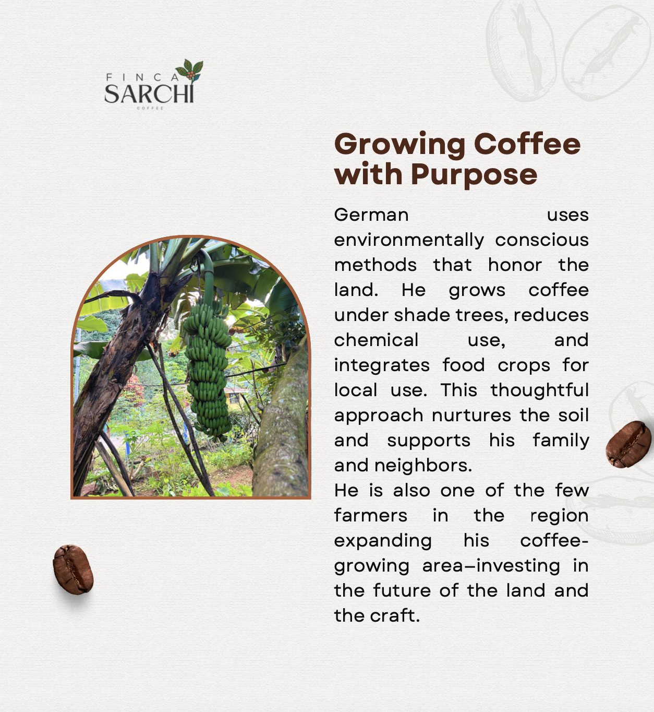

I have always been interested in coffee farming and genetics. Below there is some information about our famiy farm if you are interested!.

## Favorite Coffee Paper 1

**The genome and population genomics of coffee**  
Nature genetics, 2024  
[Read here](https://www.nature.com/articles/s41588-024-01695-w)

This paper explores coffee's population genomics and the diversification history of modern varieties!

---

## Favorite Coffee Paper 2

**Genome assembly and chromosomal aberration**  
Nature communications, 2024  
[Read here]([https://doi.org/10.1111/tpj.14789](https://www.nature.com/articles/s41467-023-44449-8))

This paper explores the complex history of coffee and how the variation is given by changes in chromosomal aberrations of two founder ancestral species namely C. eugenoides and C. canephora. 
