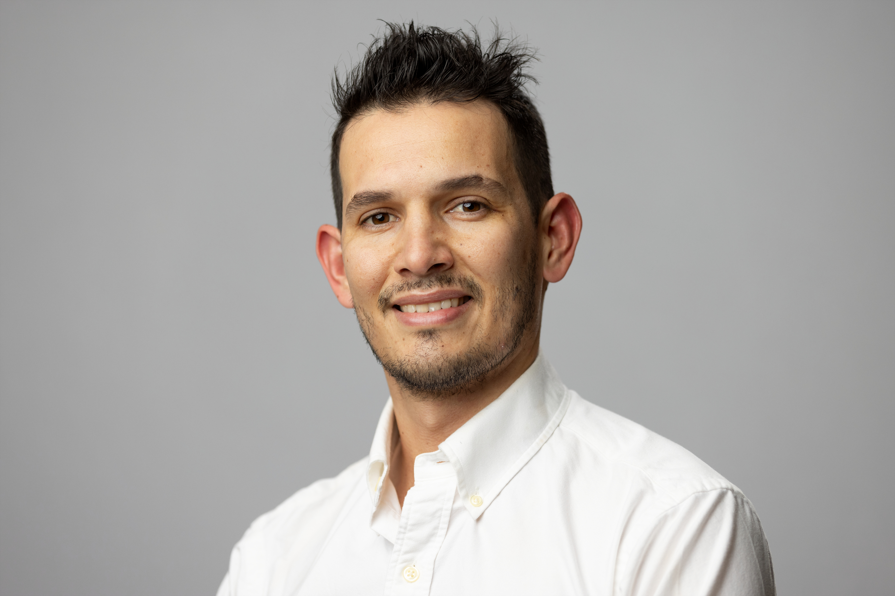

🇺🇸 Madison, WI & 🇨🇷 Sarchí, Costa Rica  
[LinkedIn](https://www.linkedin.com/in/vegaalfaro) | [GitHub](https://github.com/vegaalfaro) | [Publications](https://orcid.org/0000-0002-3293-9456)  

---

## About Andrey

I am a plant breeder and geneticist passionate about building food systems through science and innovation. My work spans crops like beet, carrot, onion, tomato, pepper, and coffee, with a focus on integrating molecular tools, phenotypic data, and farmer-centered practical approaches. I am currently a Postdoctoral Research Associate at the University of Wisconsin–Madison, where I lead R&D efforts for root vegetable breeding and genetics.

I am also super interested in agribusiness, entrepreneurship and poetry. I am originally from Costa Rica and my favority music genera is reggaeton but I also like classical performance specially [Beethoven's 9th](https://www.youtube.com/watch?v=rOjHhS5MtvA) by my beloved [Chicago Symphony Orchestra](https://cso.org/) and [Maestro Mutti](https://www.riccardomuti.com/en/)

---

## Education

**PhD, Plant Breeding and Plant Genetics**  
*University of Wisconsin–Madison* — 2023

**MS, Plant Breeding and Plant Genetics**  
*University of Wisconsin–Madison* — 2020

**Licentiate, Agronomy Engineering**  
*Costa Rica Institute of Technology (TEC)* — 2018

---

## Experience

### Plant Breeding Research Associate  
**University of Wisconsin–Madison** | *Sep 2023 – Present*  
- Led development of improved beet germplasm now used globally.  
- Integrated genetic, molecular, and field data to support trait discovery.  
- Managed field trials for onion, carrot, and beet across seasons.

### Plant Breeding Research Assistant  
**University of Wisconsin–Madison** | *May 2018 – Aug 2023*  
- Supported breeding of tomato, pepper, and bean lines for global impact.  
- Collaborated with TEC (Costa Rica), Zamorano (Honduras), and USAID.  
- Analyzed genomic and phenotypic data and co-authored peer-reviewed publications.

### Coffee Consultant & Farm Manager  
**Sarchí, Costa Rica** | *2013 – Present*  
- Managed high-altitude Arabica production (2013–2018).  
- Provided consulting on climate resilience, nutrition, and marketing.  
- Grew up in a multi-generation coffee farming family.
- Picked up and harvested the coffee myself for quite a while

---

## Some Awards

- **Science Communication Award**, Wisconsin Initiative for Scientific Literacy (2024)  
- **Best Research in Plant Breeding**, PCCMCA, Costa Rica (2024)  
- **Young Minds Award**, ISHS, United Kingdom (2023)  

---

## Languages

- Spanish & English (Native proficiency)  
- Italian (Intermediate A2, MCER)  

---

## Projects

Check out my projects and packages on [GitHub](https://github.com/vegaalfaro), including:
- `geneticMapR`: Tools for linkage mapping and haplotype visualization in R  
- Ongoing research in GWAS, table beet genetics, crop diversity, and science communication

---

## Contact

Feel free to reach out via email (vega.andrey@gmail.com) or LinkedIn for collaboration opportunities, consulting, or a good chat about seeds, science, and storytelling.

---

---

> *"Local roots, global fruits."*  
>  A vision for plant breeding that connects tradition, science, and the future
