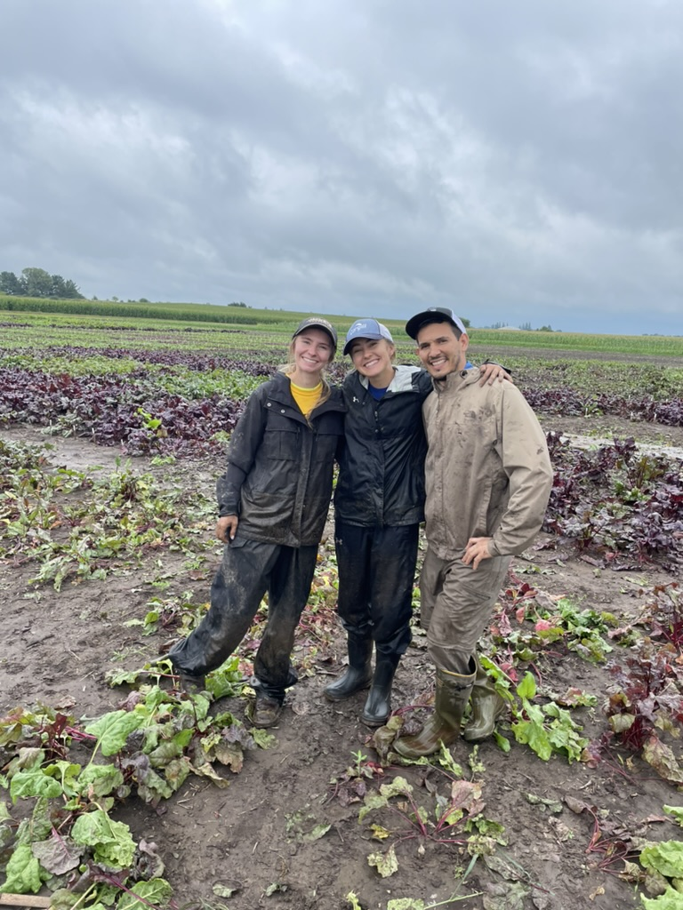
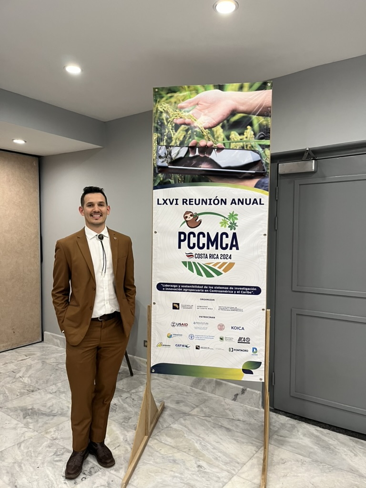
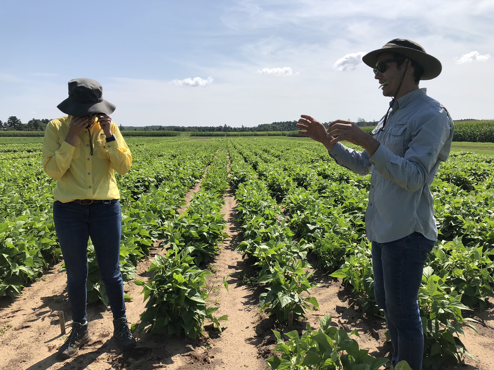
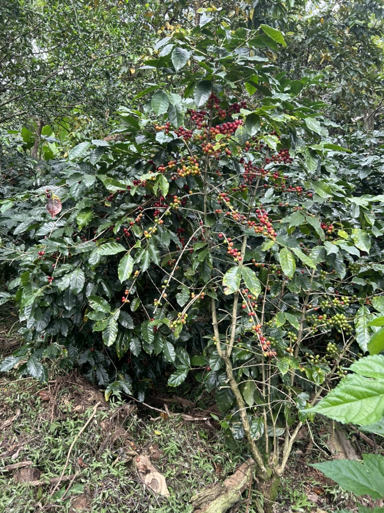
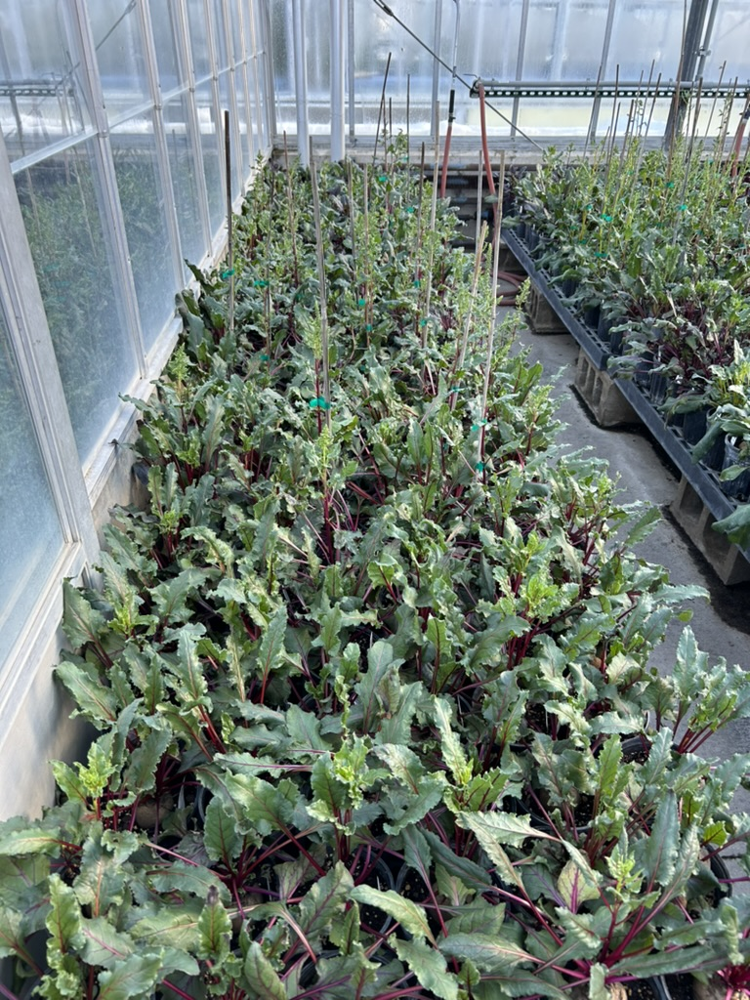
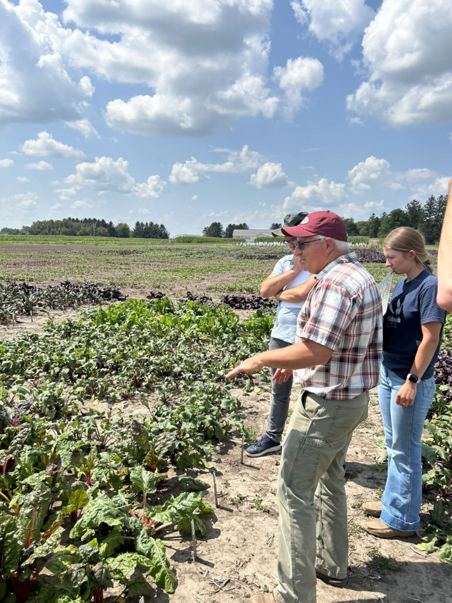
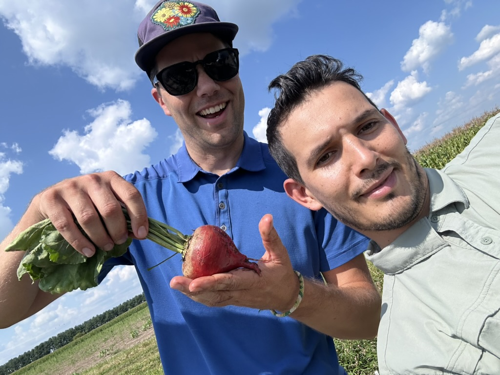
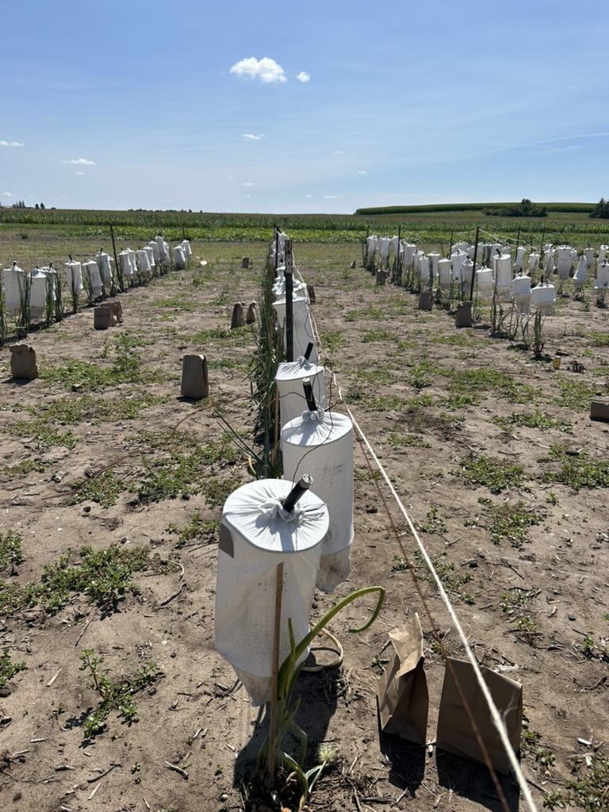
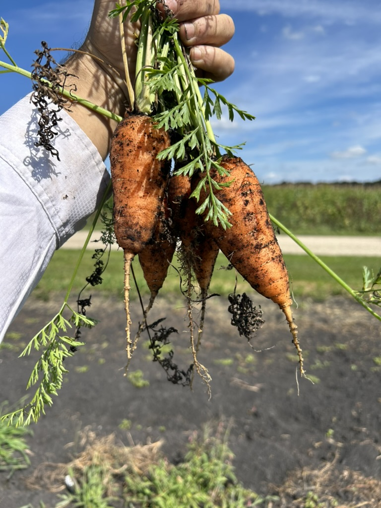
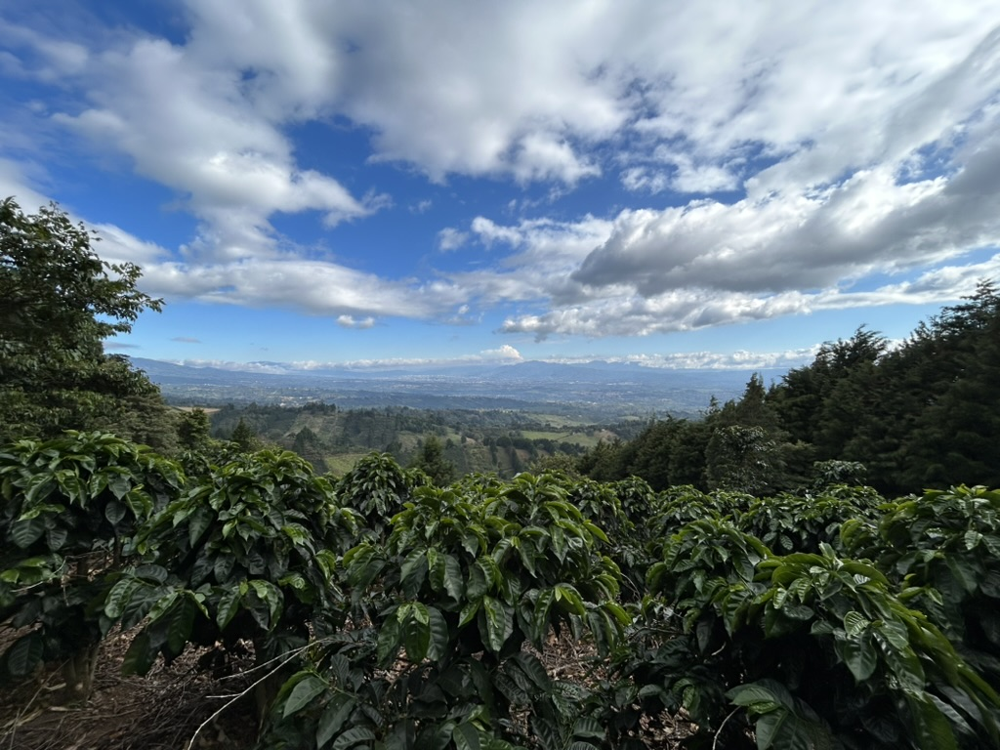

More Coming soon.

Harvesting beets on a really long and wet day at Arlington, Wisconsin with my colleagues A. Pelikan (left) and A. Morrison (center).

In the PCCMCA conference in San Jose Costa Rica. I won a best research award at that conference! that's why I was looking so happy!

In the Hancock Agricultural Research Station circa 2018 with my Colleague P. Quesada. Photo by Becca Honeyball.

A coffee plant in our Family's coffee farm.

Our beets growin in the middle of the raw Wisconsin Winter at Walnut St. Greenhouse.

My major professor Irwin Goldman demonstrating beet traits in the field for us.

Liam, co-inventors of a beet variety named Varsity! 

Harvesting Onion seed and making onion crosses in the white cages.

Some of the carrots with new shape that I helped develop.

The view from a high-altitute coffee farm

